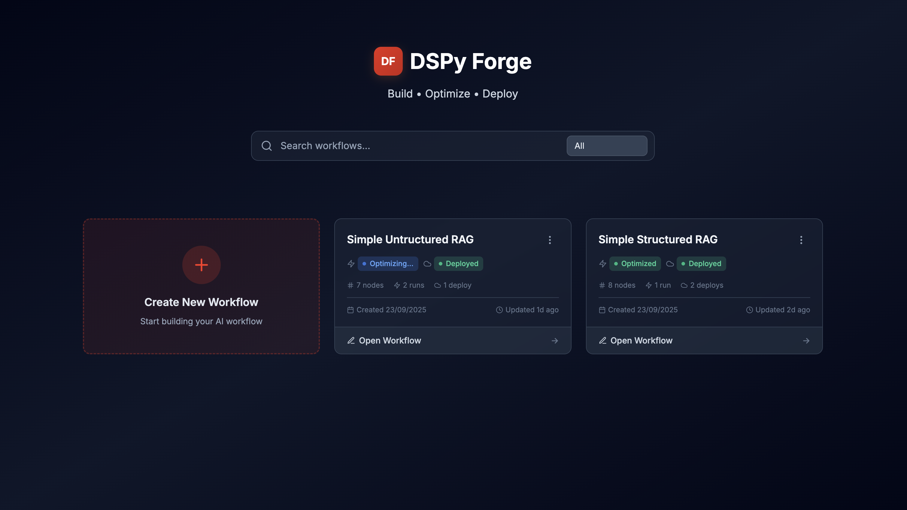
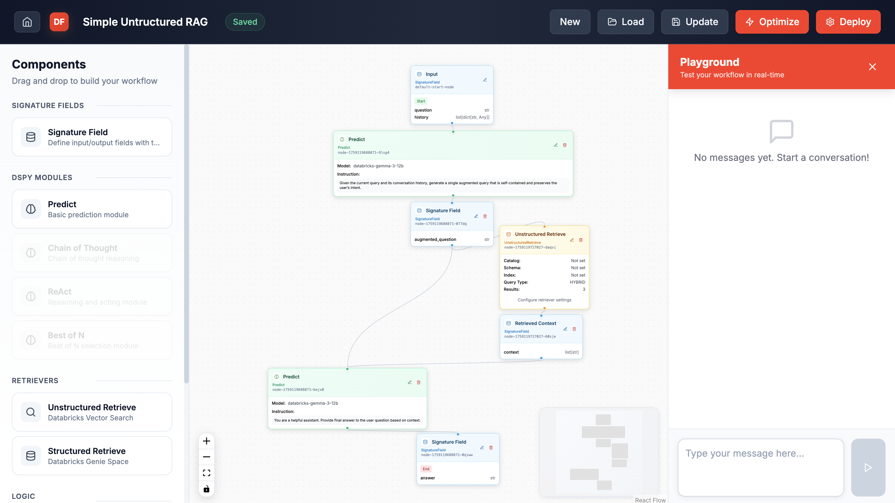

# DSPy Forge

A visual platform for building, prototyping, and deploying multi-step agentic programs on Databricks using DSPy's programming and signature based primitives.

## Overview

DSPy Forge provides a drag-and-drop interface for creating sophisticated AI workflows that combine retrieval, reasoning, and action components. Program workflows are executed in an integrated playground and deployed to Databricks serving using Agent Framework.

NOTE: The DSPy Forge is designed to only work with Models & Retrievers available on Databricks.




**Key Features:**
- Visual drag-and-drop workflow builder with DSPy modules (Predict, ChainOfThought, React, ReAct, ProgramOfThought, Refine, BestOfN)
- Native Databricks integration: Vector Search, Genie Spaces, Unity Catalog, MLflow, Agent Framework
- DSPy optimization: GEPA, MIPROv2 with custom scoring functions
- Integrated playground for testing with execution traces
- One-click deployment to Databricks serving endpoints with OBO authentication

## 🏗️ Architecture

```
dspy-forge/
├── src/dspy_forge/                # Python Backend
│   ├── main.py                    # FastAPI application entry point
│   ├── api/                       # REST API endpoints
│   │   ├── routes.py              # Main router configuration
│   │   └── endpoints/
│   │       ├── workflows.py       # Workflow CRUD & deployment
│   │       └── execution.py       # Playground execution
│   ├── services/                  # Business logic layer
│   │   ├── workflow_service.py    # Workflow management
│   │   ├── execution_service.py   # Workflow execution engine
│   │   ├── compiler_service.py    # DSPy code generation
│   │   ├── validation_service.py  # Workflow validation
│   │   ├── optimization_service.py# Workflow optimization
│   │   └── deployment_service.py  # Databricks deployment
│   ├── components/                # DSPy component templates
│   │   ├── registry.py            # Template factory & dispatchers
│   │   ├── module_templates.py    # Predict, ChainOfThought
│   │   ├── retriever_templates.py # Vector search retrievers
│   │   ├── logic_templates.py     # Control flow components
│   │   └── signature_field.py     # Dynamic signature handling
│   ├── storage/                   # Storage backends
│   │   ├── factory.py             # Storage backend factory
│   │   ├── local.py               # Local filesystem storage
│   │   └── databricks.py          # Unity Catalog volumes
│   ├── deployment/                # Databricks integration
│   │   ├── runner.py              # Agent deployment orchestration
│   │   └── agent.py               # Generated agent wrapper
│   ├── models/                    # Pydantic data models
│   │   └── workflow.py            # Workflow, Node, Edge models
│   └── core/                      # Core utilities
│       ├── config.py              # Settings management
│       ├── dspy_types.py          # DSPy type definitions
│       └── logging.py             # Structured logging
├── ui/                            # React Frontend
│   ├── src/
│   │   ├── App.tsx                # Main application component
│   │   ├── components/
│   │   │   ├── WorkflowBuilder.tsx      # Main canvas interface
│   │   │   ├── ComponentSidebar.tsx     # Draggable component library
│   │   │   ├── PlaygroundSidebar.tsx    # Testing interface
│   │   │   ├── WorkflowList.tsx         # Workflow management
│   │   │   └── nodes/                   # Custom ReactFlow node types
│   │   │       ├── ModuleNode.tsx       # DSPy module nodes
│   │   │       ├── RetrieverNode.tsx    # Retriever nodes
│   │   │       ├── LogicNode.tsx        # Logic component nodes
│   │   │       ├── SignatureFieldNode.tsx # Signature field nodes
│   │   │       └── TraceIndicator.tsx   # Execution trace visualization
│   │   ├── types/                 # TypeScript type definitions
│   │   ├── hooks/                 # React hooks
│   │   └── contexts/              # React contexts
│   └── package.json
├── pyproject.toml                 # Python dependencies & metadata
└── README.md
```

## 🚀 Quick Start

### Prerequisites
- **Python 3.11+** with pip or uv
- **Node.js 16+** with npm
- **Databricks Workspace** (for deployment)

### Installation & Setup

1. **Clone the repository**:
```bash
git clone <repository-url>
cd databricks-dspy-forge
```

2. **Backend Setup**:
```bash
# Create virtual environment
python -m venv .venv
source .venv/bin/activate  # Windows: .venv\Scripts\activate

# Install dependencies
pip install -e .

# Configure environment
cp .env.example .env
# Edit .env with your Databricks credentials
```

3. **Frontend Setup**:
```bash
cd ui
npm install
```

4. **Start Development Servers**:
```bash
# Terminal 1: Backend
uv run dspy-forge --reload

# Terminal 2: Frontend (in ui/ directory)
npm start
```

Access the application at `http://localhost:3000`

### Environment Configuration

Create `.env` file in the root directory:

```env
# Storage Backend ("local" or "databricks")
STORAGE_BACKEND=local
ARTIFACTS_PATH=./artifacts

# Databricks Configuration (required for deployment)
DATABRICKS_HOST=https://your-workspace.cloud.databricks.com
DATABRICKS_TOKEN=dapi...
# Or use profile-based auth
DATABRICKS_CONFIG_PROFILE=DEFAULT

# Logging
LOG_LEVEL=INFO
```

## Usage

**Workflow Patterns:**
```
Simple:       Input → Predict → Output
RAG:          Input → UnstructuredRetrieve → Predict → Output
RAG:          Input → StructuredRetrieve → Predict → Output
Multi-Step:   Input → ChainOfThought → FieldSelector → Predict → Output
```

**Workflow:** Dashboard → Create → Drag components → Configure → Connect → Test (Playground) → Optimize → Deploy

**Deployment:** Run locally for user auth, or on Databricks Apps with service principal. Use Unity Catalog Volumes for shared storage.

## Components

**Signature Fields:** Define I/O specs with types

**DSPy Modules:**
- **Predict** - Basic LLM prediction
- **ChainOfThought** - Step-by-step reasoning
- **ReAct with Tools** - Reason + Act with tool integration
- **ProgramOfThought** - Code generation for reasoning
- **Refine** - Iterative output improvement
- **BestOfN** - Generate N candidates, select best

**Retrievers:**
- **UnstructuredRetrieve** - Databricks Vector Search integration
- **StructuredRetrieve** - Genie Spaces for NL-to-SQL (OBO auth)

**Logic:**
- **If-Else** - Conditional branching
- **Field Selector** - Extract/rename fields
- **Merge** - Combine parallel outputs

## 🎯 Optimization

**Optimizers:**
- **GEPA** - Gradient-free prompt optimization for structured tasks
- **BootstrapFewShotWithRandomSearch** - Bootstrap few-shot examples from training data
- **MIPROv2** - Multi-prompt instruction + few-shot co-optimization

**Scoring Functions:** Correctness (binary w/ ground truth), Guidelines (LLM-based qualitative). Total weightage must = 100.

**Training Data:** Delta tables with input columns matching workflow signature. Optional output columns for ground truth.

**Process:** Build → Test → Click "Optimize" → Configure (optimizer, scoring, data tables) → Run on SQL Warehouse → Apply results

**Output:** Optimized prompts, few-shot examples, performance metrics

## API

### Workflow Management
- `POST /api/v1/workflows/` - Create new workflow
- `GET /api/v1/workflows/` - List all workflows
- `GET /api/v1/workflows/{id}` - Get workflow by ID
- `GET /api/v1/workflows/{id}/history` - Get workflow version history
- `PUT /api/v1/workflows/{id}` - Update workflow
- `DELETE /api/v1/workflows/{id}` - Delete workflow
- `POST /api/v1/workflows/{id}/duplicate` - Duplicate workflow
- `POST /api/v1/workflows/{id}/validate` - Validate workflow structure

### Execution
- `POST /api/v1/execution/playground` - Execute workflow in playground

### Deployment
- `POST /api/v1/workflows/deploy/{id}` - Deploy workflow to Databricks
- `GET /api/v1/workflows/deploy/status/{deployment_id}` - Check deployment status

### Optimization
- `POST /api/v1/workflows/optimize` - Start optimization job
- `GET /api/v1/workflows/optimize/status/{optimization_id}` - Check optimization status

### Health
- `GET /api/v1/workflows/_health` - Health check endpoint

## Development

### Adding New DSPy Modules

1. Create template in `src/dspy_forge/components/module_templates.py`
2. Implement `initialize()`, `acall()` and `call()` methods
3. Add to `TemplateFactory` in `registry.py`
4. Create UI node component in `ui/src/components/nodes/`
5. Register node type in `ComponentSidebar.tsx`

### Adding New Optimizers

1. Add optimizer to `optimization_service.py`
2. Update `OptimizationRequest` model in `api/endpoints/workflows.py`
3. Add UI option in `OptimizeModal.tsx`
4. Document configuration parameters

## Technology Stack

**Backend:** FastAPI, DSPy, Pydantic, Databricks SDK, MLflow
**Frontend:** React 18, TypeScript, React Flow, TailwindCSS
**Storage:** Unity Catalog Volumes, Local filesystem
**Authentication:** Databricks OAuth, OBO tokens

## Contributing

1. Fork repository and create feature branch
2. Make changes and add tests
3. Submit pull request with clear description

## License

MIT License