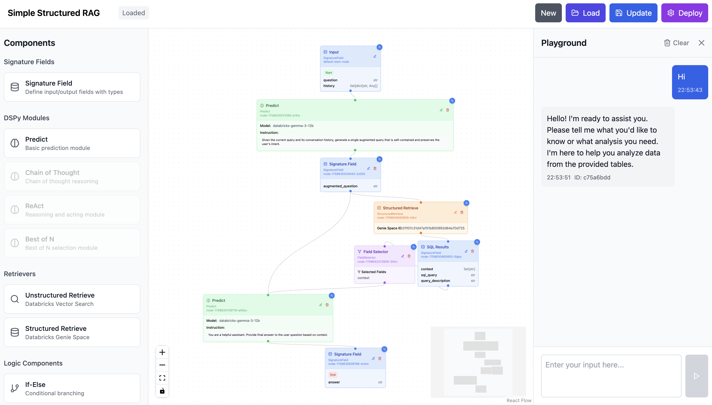
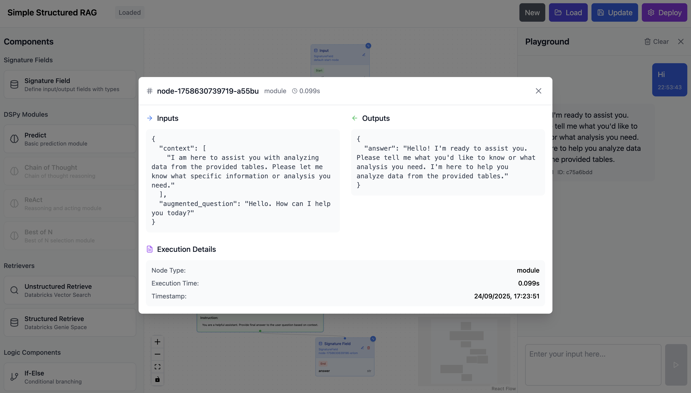

# DSPy Forge

A visual platform for building, prototyping, and deploying multi-step agentic programs on Databricks using DSPy's programming and signature based primitives.

## Overview

DSPy Forge provides a drag-and-drop interface for creating sophisticated AI workflows that combine retrieval, reasoning, and action components. Program workflows are executed in an integrated playground and deployed as production Databricks agents.

NOTE: The DSPy Forge is designed to only work with Models & Retrievers available on Databricks.


*Visual drag-and-drop interface for building DSPy workflows*


*Flow execution visualization with step-by-step traces*

**Key Capabilities:**
- Visual workflow design with DSPy modules
- Native Databricks integration (Vector Search, Genie, Agent Framework, MLflow, Unity Catalog)
- Multi-step agentic programs with conditional logic and data transformation
- One-click deployment to Databricks serving endpoints using agent framework

## 🏗️ Architecture

```
dspy-forge/
├── src/dspy_forge/                # Python Backend
│   ├── main.py                    # FastAPI application entry point
│   ├── api/                       # REST API endpoints
│   │   ├── routes.py              # Main router configuration
│   │   └── endpoints/
│   │       ├── workflows.py       # Workflow CRUD & deployment
│   │       └── execution.py       # Playground execution
│   ├── services/                  # Business logic layer
│   │   ├── workflow_service.py    # Workflow management
│   │   ├── execution_service.py   # Workflow execution engine
│   │   ├── compiler_service.py    # DSPy code generation
│   │   ├── validation_service.py  # Workflow validation
│   │   └── deployment_service.py  # Databricks deployment
│   ├── components/                # DSPy component templates
│   │   ├── registry.py            # Template factory & dispatchers
│   │   ├── module_templates.py    # Predict, ChainOfThought
│   │   ├── retriever_templates.py # Vector search retrievers
│   │   ├── logic_templates.py     # Control flow components
│   │   └── signature_field.py     # Dynamic signature handling
│   ├── storage/                   # Storage backends
│   │   ├── factory.py             # Storage backend factory
│   │   ├── local.py               # Local filesystem storage
│   │   └── databricks.py          # Unity Catalog volumes
│   ├── deployment/                # Databricks integration
│   │   ├── runner.py              # Agent deployment orchestration
│   │   └── agent.py               # Generated agent wrapper
│   ├── models/                    # Pydantic data models
│   │   └── workflow.py            # Workflow, Node, Edge models
│   └── core/                      # Core utilities
│       ├── config.py              # Settings management
│       ├── dspy_types.py          # DSPy type definitions
│       └── logging.py             # Structured logging
├── ui/                            # React Frontend
│   ├── src/
│   │   ├── App.tsx                # Main application component
│   │   ├── components/
│   │   │   ├── WorkflowBuilder.tsx      # Main canvas interface
│   │   │   ├── ComponentSidebar.tsx     # Draggable component library
│   │   │   ├── PlaygroundSidebar.tsx    # Testing interface
│   │   │   ├── WorkflowList.tsx         # Workflow management
│   │   │   └── nodes/                   # Custom ReactFlow node types
│   │   │       ├── ModuleNode.tsx       # DSPy module nodes
│   │   │       ├── RetrieverNode.tsx    # Retriever nodes
│   │   │       ├── LogicNode.tsx        # Logic component nodes
│   │   │       ├── SignatureFieldNode.tsx # Signature field nodes
│   │   │       └── TraceIndicator.tsx   # Execution trace visualization
│   │   ├── types/                 # TypeScript type definitions
│   │   ├── hooks/                 # React hooks
│   │   └── contexts/              # React contexts
│   └── package.json
├── pyproject.toml                 # Python dependencies & metadata
└── README.md
```

## 🚀 Quick Start

### Prerequisites
- **Python 3.11+** with pip or uv
- **Node.js 16+** with npm
- **Databricks Workspace** (for deployment)

### Installation & Setup

1. **Clone the repository**:
```bash
git clone <repository-url>
cd databricks-dspy-forge
```

2. **Backend Setup**:
```bash
# Create virtual environment
python -m venv .venv
source .venv/bin/activate  # Windows: .venv\Scripts\activate

# Install dependencies
pip install -e .

# Configure environment
cp .env.example .env
# Edit .env with your Databricks credentials
```

3. **Frontend Setup**:
```bash
cd ui
npm install
```

4. **Start Development Servers**:
```bash
# Terminal 1: Backend
uv run dspy-forge --reload

# Terminal 2: Frontend (in ui/ directory)
npm start
```

Access the application at `http://localhost:3000`

### Environment Configuration

Create `.env` file in the root directory:

```env
# Storage Backend ("local" or "databricks")
STORAGE_BACKEND=local
ARTIFACTS_PATH=./artifacts

# Databricks Configuration (required for deployment)
DATABRICKS_HOST=https://your-workspace.cloud.databricks.com
DATABRICKS_TOKEN=dapi...
# Or use profile-based auth
DATABRICKS_CONFIG_PROFILE=DEFAULT

# Logging
LOG_LEVEL=INFO
```

## Usage

The DSPy Forge is meant to be run on your local with Databricks Volumes as persistent storage layer. Although it can be deployed on Databricks Apps as well, but then execution and deployment happens using App SP and not user. When running on local everything happens as user.

### Basic Workflow Patterns

**Simple Prediction:**
```
Input → Predict → Output
```

**RAG with Vector Search:**
```
Input → UnstructuredRetrieve → Predict → Output
```

**Multi-Step Reasoning:**
```
Input → ChainOfThought → Field Selector → Predict → Output
```

**SQL Generation:**
```
Question → StructuredRetrieve → Predict → Output
```

## Components

**Signature:** Signature Fields
**DSPy Modules:** Predict, ChainOfThought, React, Refine, BestOfN
**Retrievers:** UnstructuredRetrieve (Vector Search), StructuredRetrieve (Genie Spaces)
**Logic:** If-Else, Field Selector, Merge
**Types:** str, int, bool, float, list[str], list[int], dict

## API

**Workflows:** CRUD operations (`/api/v1/workflows/`)
**Execution:** Playground testing (`/api/v1/execution/playground`)
**Deployment:** Deploy to Databricks (`/api/v1/workflows/deploy/{id}`)

## Deployment

Workflows are automatically compiled to DSPy programs and deployed as Databricks agents:

1. Workflow validation and code generation
2. MLflow model packaging with dependencies
3. Unity Catalog registration
4. Serving endpoint deployment with auto-scaling

**Generated Resources:**
- MLflow Model: `{catalog}.{schema}.{model_name}`
- Serving Endpoint: `agents_{model_name}`
- Auth policies for Vector Search/Genie access

## Technology Stack

**Backend:** FastAPI, DSPy, Pydantic, Databricks SDK, MLflow
**Frontend:** React 18, TypeScript, React Flow, TailwindCSS
**Storage:** Unity Catalog Volumes, Local filesystem
**Authentication:** Databricks OAuth, OBO tokens

## Contributing

1. Fork repository and create feature branch
2. Make changes and add tests
3. Submit pull request with clear description

## License

MIT License